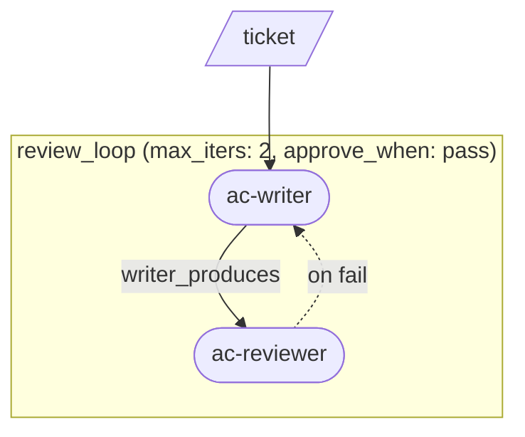

# Getting started with loom

This guide builds a real multi-agent pipeline from scratch, one primitive per chapter. By the end you will have a pipeline that takes a ticket, writes and refines acceptance criteria with a human-in-the-loop checkpoint, produces a technically reviewed spec, and then implements the spec in parallel subtasks — each with its own build-test-review retry loop. The scenario is a concrete engineering ticket: an in-memory rate-limiter middleware. Estimated time: ~30 minutes.

---

## Chapter 0 — Before you start

### Prerequisites

- `agenticloom` installed (`npm install -g agenticloom`) and `loom` on your PATH.
- Claude Code CLI installed and authenticated, **or** GitHub Copilot CLI installed and authenticated (see the callout below).

### What an agent persona is

A persona is a Markdown file that tells the CLI agent who it is and what it should do. For Claude Code, personas live in `.claude/agents/<name>.md` in your working directory. A minimal example:

```markdown
---
name: ac-writer
description: Writes acceptance criteria from a ticket
tools: Read, Write
---

You are an acceptance-criteria writer. Read the ticket at the path in
your prompt and write ACS.md containing Given/When/Then scenarios.
```

The frontmatter `name` must match the agent name used in the pipeline. The prompt body is the full system instruction passed to the agent when loom invokes it.

### Using Copilot CLI instead of Claude Code

Every pipeline in this guide ships with `cli: claude` and a Claude model in `default_extra_args`. To run with Copilot CLI instead, make two changes to any pipeline YAML:

```yaml
cli: copilot                              # was: cli: claude
default_extra_args: ['--model', 'gpt-4.1'] # was: ['--model', 'haiku']
```

Persona files for Copilot use a different frontmatter format (lowercase array `tools:` in `.github/agents/` rather than PascalCase comma-separated `tools:` in `.claude/agents/`). The starter pack ships both directories so both CLIs work out of the box — see `examples/getting-started/README.md` for a one-liner `sed` that swaps all six pipeline YAMLs at once.

### Following along

The `examples/getting-started/` directory is a runnable companion to this guide. Each chapter's pipeline YAML is already there. To run chapter 1 against a ticket:

```bash
cd examples/getting-started
loom run 01-first-step ticket.md
```

`loom run` takes the pipeline name and the ticket file as positional arguments. Chapters 3 through 6 include a `human_gate` that will pause and hand control to you interactively.

---

## Chapter 1 — Your first pipeline (`step`)

### Why

The simplest thing loom can do is invoke one agent, once, and capture its output. The `step` primitive is that unit. Until you need iteration or parallelism, every flow is just a sequence of steps.

### YAML

```yaml
pipeline: 01-first-step
cli: claude                              # or 'copilot' — see Before you start
default_extra_args: ['--model', 'haiku'] # Copilot: ['--model', 'gpt-4.1']
inputs: [ticket]
flow:
  - step: ac-writer
    input: $ticket
    produces: ACS.md
    bind: acs
```

### Walkthrough

**Header fields**

- `pipeline` — the pipeline's name, also used as its run directory.
- `cli` — which CLI agent runner to use (`claude` or `copilot`). Swap this (and `default_extra_args`) once to run the whole guide under Copilot.
- `default_extra_args` — extra flags appended to every agent invocation. `['--model', 'haiku']` pins a cheap model for tutorial runs; drop the flag or change it for real work.
- `inputs` — the list of named inputs the caller must supply when running the pipeline. Here, `ticket` is the rate-limiter ticket file.

**The `flow` list**

`flow` is an ordered list of primitives. Loom runs them top-to-bottom, threading outputs into subsequent inputs via named bindings.

**`step` fields**

- `step: ac-writer` — the agent persona to invoke. Loom resolves this to `.claude/agents/ac-writer.md` (or `.github/agents/ac-writer.md` for Copilot).
- `input: $ticket` — the `$` prefix dereferences a named binding. `$ticket` resolves to the path of the ticket file you passed on the command line.
- `produces: ACS.md` — the file this agent is expected to write. Loom makes the path available to the agent in its prompt.
- `bind: acs` — after the step completes, bind the path of the produced file to the name `acs`, so later steps can reference it as `$acs`.

### What changed

This is the baseline — a single agent invocation. Subsequent chapters build on top of it.

---

## Chapter 2 — Add a reviewer (`review_loop`)

### Why

A single agent cannot check its own work reliably. The `review_loop` primitive pairs a writer with a reviewer: the writer produces an artifact, the reviewer emits a structured verdict, and if the verdict is not `pass` the writer revises — up to `max_iters` times. Loom manages the loop; you just name the agents and the verdict contract.

### YAML

```yaml
pipeline: 02-review-loop
cli: claude                              # or 'copilot' — see Before you start
default_extra_args: ['--model', 'haiku'] # Copilot: ['--model', 'gpt-4.1']
inputs: [ticket]
flow:
  - review_loop:
      writer: ac-writer
      reviewer: ac-reviewer
      input: $ticket
      max_iters: 2
      writer_produces: ACS.md
      reviewer_produces: ac-review.json
      verdict_field: status
      approve_when: pass
      bind: ac_final
```

### Walkthrough

**`review_loop` fields (new in this chapter)**

- `writer` / `reviewer` — agent persona names. The writer runs first; the reviewer runs on the writer's output.
- `input` — the initial input passed to the writer on the first iteration. On subsequent iterations, loom automatically appends the reviewer's feedback file to the writer's prompt.
- `max_iters` — the maximum number of writer passes. If the reviewer does not approve within this many iterations, the loop exits with the last artifact.
- `writer_produces` / `reviewer_produces` — the file each side writes. The reviewer's file must be valid JSON.
- `verdict_field` — the JSON key in the reviewer's output that carries the verdict. Here the reviewer writes `{ "status": "pass" | "fail", ... }` and `verdict_field: status` tells loom where to read the decision.
- `approve_when` — the value of `verdict_field` that means "approved". Loom exits the loop early as soon as the reviewer emits this value.
- `bind: ac_final` — binds the path of the final approved artifact, so later steps can reference it as `$ac_final`.

**The reviewer JSON contract**

Reviewer personas in this guide all emit the same shape:

```json
{ "status": "pass", "summary": "one-line rationale", "findings": [] }
```

`status` is exactly `"pass"` or `"fail"`. Keeping this contract consistent across all reviewer personas means you can swap them in and out of any `review_loop` without changing the pipeline.

### Diagram



### What changed

Chapter 1's single `step` became a `review_loop` — `ac-writer` and `ac-reviewer` now iterate until the reviewer approves or the iteration cap is reached.
