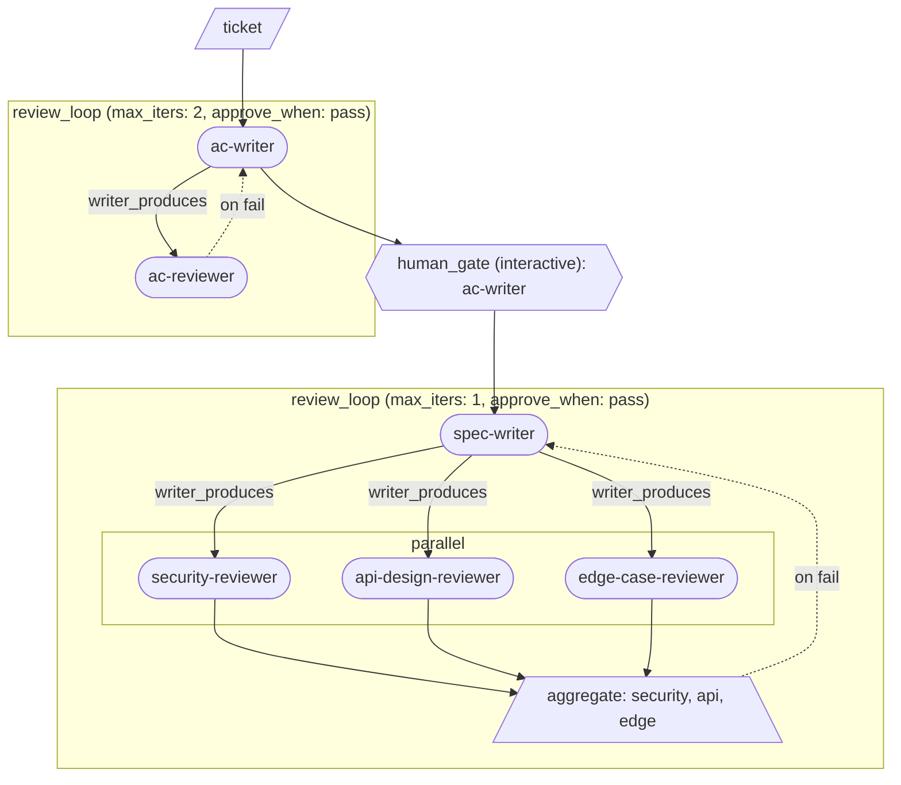

# Getting started with loom

This guide builds a real multi-agent pipeline from scratch, one primitive per chapter. By the end you will have a pipeline that takes a ticket, writes and refines acceptance criteria with a human-in-the-loop checkpoint, produces a technically reviewed spec, and then implements the spec in parallel subtasks — each with its own build-test-review retry loop. The scenario is a concrete engineering ticket: an in-memory rate-limiter middleware. Estimated time: ~30 minutes.

---

## Chapter 0 — Before you start

### Prerequisites

- `agenticloom` installed (`npm install -g agenticloom`) and `loom` on your PATH.
- Claude Code CLI installed and authenticated, **or** GitHub Copilot CLI installed and authenticated (see the callout below).

### What an agent persona is

A persona is a Markdown file that tells the CLI agent who it is and what it should do. For Claude Code, personas live in `.claude/agents/<name>.md` in your working directory. A minimal example:

```markdown
---
name: ac-writer
description: Writes acceptance criteria from a ticket
tools: Read, Write
---

You are an acceptance-criteria writer. Read the ticket at the path in
your prompt and write ACS.md containing Given/When/Then scenarios.
```

The frontmatter `name` must match the agent name used in the pipeline. The prompt body is the full system instruction passed to the agent when loom invokes it.

### Using Copilot CLI instead of Claude Code

Every pipeline in this guide ships with `cli: claude` and a Claude model in `default_extra_args`. To run with Copilot CLI instead, make two changes to any pipeline YAML:

```yaml
cli: copilot                              # was: cli: claude
default_extra_args: ['--model', 'gpt-4.1'] # was: ['--model', 'haiku']
```

Persona files for Copilot use a different frontmatter format (lowercase array `tools:` in `.github/agents/` rather than PascalCase comma-separated `tools:` in `.claude/agents/`). The starter pack ships both directories so both CLIs work out of the box — see `examples/getting-started/README.md` for a one-liner `sed` that swaps all six pipeline YAMLs at once.

### Following along

The `examples/getting-started/` directory is a runnable companion to this guide. Each chapter's pipeline YAML is already there. To run chapter 1 against a ticket:

```bash
cd examples/getting-started
loom run 01-first-step ticket.md
```

`loom run` takes the pipeline name and the ticket file as positional arguments. Chapters 3 through 6 include a `human_gate` that will pause and hand control to you interactively.

---

## Chapter 1 — Your first pipeline (`step`)

### Why

The simplest thing loom can do is invoke one agent, once, and capture its output. The `step` primitive is that unit. Until you need iteration or parallelism, every flow is just a sequence of steps.

### YAML

```yaml
pipeline: 01-first-step
cli: claude                              # or 'copilot' — see Before you start
default_extra_args: ['--model', 'haiku'] # Copilot: ['--model', 'gpt-4.1']
inputs: [ticket]
flow:
  - step: ac-writer
    input: $ticket
    produces: ACS.md
    bind: acs
```

### Walkthrough

**Header fields**

- `pipeline` — the pipeline's name, also used as its run directory.
- `cli` — which CLI agent runner to use (`claude` or `copilot`). Swap this (and `default_extra_args`) once to run the whole guide under Copilot.
- `default_extra_args` — extra flags appended to every agent invocation. `['--model', 'haiku']` pins a cheap model for tutorial runs; drop the flag or change it for real work.
- `inputs` — the list of named inputs the caller must supply when running the pipeline. Here, `ticket` is the rate-limiter ticket file.

**The `flow` list**

`flow` is an ordered list of primitives. Loom runs them top-to-bottom, threading outputs into subsequent inputs via named bindings.

**`step` fields**

- `step: ac-writer` — the agent persona to invoke. Loom resolves this to `.claude/agents/ac-writer.md` (or `.github/agents/ac-writer.md` for Copilot).
- `input: $ticket` — the `$` prefix dereferences a named binding. `$ticket` resolves to the path of the ticket file you passed on the command line.
- `produces: ACS.md` — the file this agent is expected to write. Loom makes the path available to the agent in its prompt.
- `bind: acs` — after the step completes, bind the path of the produced file to the name `acs`, so later steps can reference it as `$acs`.

### What changed

This is the baseline — a single agent invocation. Subsequent chapters build on top of it.

---

## Chapter 2 — Add a reviewer (`review_loop`)

### Why

A single agent cannot check its own work reliably. The `review_loop` primitive pairs a writer with a reviewer: the writer produces an artifact, the reviewer emits a structured verdict, and if the verdict is not `pass` the writer revises — up to `max_iters` times. Loom manages the loop; you just name the agents and the verdict contract.

### YAML

```yaml
pipeline: 02-review-loop
cli: claude                              # or 'copilot' — see Before you start
default_extra_args: ['--model', 'haiku'] # Copilot: ['--model', 'gpt-4.1']
inputs: [ticket]
flow:
  - review_loop:
      writer: ac-writer
      reviewer: ac-reviewer
      input: $ticket
      max_iters: 2
      writer_produces: ACS.md
      reviewer_produces: ac-review.json
      verdict_field: status
      approve_when: pass
      bind: ac_final
```

### Walkthrough

**`review_loop` fields (new in this chapter)**

- `writer` / `reviewer` — agent persona names. The writer runs first; the reviewer runs on the writer's output.
- `input` — the initial input passed to the writer on the first iteration. On subsequent iterations, loom automatically appends the reviewer's feedback file to the writer's prompt.
- `max_iters` — the maximum number of writer passes. If the reviewer does not approve within this many iterations, the loop exits with the last artifact.
- `writer_produces` / `reviewer_produces` — the file each side writes. The reviewer's file must be valid JSON.
- `verdict_field` — the JSON key in the reviewer's output that carries the verdict. Here the reviewer writes `{ "status": "pass" | "fail", ... }` and `verdict_field: status` tells loom where to read the decision.
- `approve_when` — the value of `verdict_field` that means "approved". Loom exits the loop early as soon as the reviewer emits this value.
- `bind: ac_final` — binds the path of the final approved artifact, so later steps can reference it as `$ac_final`.

**The reviewer JSON contract**

Reviewer personas in this guide all emit the same shape:

```json
{ "status": "pass", "summary": "one-line rationale", "findings": [] }
```

`status` is exactly `"pass"` or `"fail"`. Keeping this contract consistent across all reviewer personas means you can swap them in and out of any `review_loop` without changing the pipeline.

### Diagram


### What changed

Chapter 1's single `step` became a `review_loop` — `ac-writer` and `ac-reviewer` now iterate until the reviewer approves or the iteration cap is reached.

---

## Chapter 3 — Pause for a human (`human_gate`)

### Why

Automated reviewers can catch structural problems, but some judgment calls need a human. The `human_gate` primitive pauses the pipeline, hands control to a specified agent in interactive mode, and resumes when the human is done. It is the one non-deterministic primitive: loom cannot predict when it exits.

### YAML

```yaml
pipeline: 03-human-gate
cli: claude                              # or 'copilot' — see Before you start
default_extra_args: ['--model', 'haiku'] # Copilot: ['--model', 'gpt-4.1']
inputs: [ticket]
flow:
  - review_loop:
      writer: ac-writer
      reviewer: ac-reviewer
      input: $ticket
      max_iters: 2
      writer_produces: ACS.md
      reviewer_produces: ac-review.json
      verdict_field: status
      approve_when: pass
      bind: ac_final
  - human_gate:
      interactive: true
      agent: ac-writer
      input: $ac_final
      prompt: |
        ACS.md passed automated review. Iterate with the user —
        answer open questions, refine wording, surface gaps.
```

### Walkthrough

**`human_gate` fields (new in this chapter)**

- `interactive: true` — launches the agent in interactive mode (the CLI's interactive flag) so the user can converse with it directly in the terminal.
- `agent` — the persona to invoke at the gate. Using `ac-writer` here means the same agent that produced the ACS is the one refining it interactively.
- `input: $ac_final` — the approved ACS file from the `review_loop`. The agent receives this as context so it can discuss and revise the existing document rather than starting over.
- `prompt` — additional instructions for the agent at this gate. The `|` literal-block scalar preserves line breaks.

**Threading `$ac_final`**

`$ac_final` was bound by the `review_loop` in the previous step. The `human_gate` picks it up by name. This is how loom threads outputs through a pipeline: each primitive declares what it produces (`bind`), and downstream primitives consume it by `$name`.

### What changed

A `human_gate` was added after the `review_loop`. After automated review approves `ACS.md`, the pipeline pauses and you can refine it interactively with `ac-writer` before the pipeline continues.

---

## Chapter 4 — Parallel reviewers (`parallel` + `aggregate`)

### Why

Three independent review perspectives — security, API design, and edge cases — do not depend on each other's results. Running them sequentially wastes time. The `parallel` primitive fans them out; `aggregate` collects their verdicts and gates the loop on a combined result. Both primitives are used inside a `review_loop`'s `reviewer:` subflow, not as top-level flow steps.

### YAML

```yaml
pipeline: 04-parallel-review
cli: claude                              # or 'copilot' — see Before you start
default_extra_args: ['--model', 'haiku'] # Copilot: ['--model', 'gpt-4.1']
inputs: [ticket]
flow:
  - review_loop:
      writer: ac-writer
      reviewer: ac-reviewer
      input: $ticket
      max_iters: 2
      writer_produces: ACS.md
      reviewer_produces: ac-review.json
      verdict_field: status
      approve_when: pass
      bind: ac_final
  - human_gate:
      interactive: true
      agent: ac-writer
      input: $ac_final
      prompt: |
        ACS.md passed automated review. Iterate with the user.
  - review_loop:
      writer: spec-writer
      input: $ac_final
      max_iters: 1
      writer_produces: SPEC.md
      approve_when: pass
      bind: spec
      reviewer:
        - parallel:
            - step: security-reviewer
              input: $spec
              produces: security-review.json
              bind: sec
            - step: api-design-reviewer
              input: $spec
              produces: api-review.json
              bind: api
            - step: edge-case-reviewer
              input: $spec
              produces: edge-review.json
              bind: edge
        - aggregate:
            inputs:
              security: $sec
              api: $api
              edge: $edge
            verdict_field: status
            approve_when: pass
            require: all_approved
            bind: spec_verdict
```

### Walkthrough

**The compound `reviewer:` subflow (new in this chapter)**

When `reviewer:` is a list rather than a single agent name, it is a compound subflow. Loom runs it top-to-bottom: here, first the `parallel` fork, then the `aggregate`.

**`parallel` fields**

- `parallel:` — a list of steps to run concurrently. Each entry is a standard `step` (or a nested subflow). All three reviewers receive `$spec` and run at the same time.
- Each step has its own `bind:` (`sec`, `api`, `edge`) so the aggregate can reference their outputs individually.

**`aggregate` fields**

- `inputs:` — a named map of bindings to aggregate. The keys (`security`, `api`, `edge`) are labels; the values (`$sec`, `$api`, `$edge`) reference the bound reviewer outputs.
- `verdict_field` / `approve_when` — same semantics as in `review_loop`: which JSON key holds the verdict and what value means approved.
- `require: all_approved` — all three reviewers must pass for the aggregate to emit `pass`. If any one fails, the aggregate emits `fail` and the `review_loop` sends `spec-writer` back to revise `SPEC.md`.
- `bind: spec_verdict` — the aggregate's result is bound for the loop to read. A compound reviewer's terminal `aggregate` must declare `bind:`; loom enforces this at compile time.

**How the loop re-runs on fail**

If the aggregate result is `fail`, loom invokes `spec-writer` again. The reviewer's findings (the three JSON files) are appended to `spec-writer`'s prompt so it knows what to address.

### Diagram



### What changed

A second `review_loop` was added after the human gate. `spec-writer` produces `SPEC.md` from the approved ACS; three reviewers run in parallel and their verdicts are aggregated before the loop decides whether to loop.

---

## Chapter 5 — Implement with fail-retry (`on_fail`)

### Why

Writing an implementation, testing it, and reviewing the result is a tight loop that should self-correct without human input. The `on_fail` field turns the gate step of a sequential zone into a retry trigger: if the reviewer fails, loom replays the zone from a named starting point, feeding the reviewer's findings back to the implementer.

### YAML

```yaml
pipeline: 05-impl-retry
cli: claude                              # or 'copilot' — see Before you start
default_extra_args: ['--model', 'haiku'] # Copilot: ['--model', 'gpt-4.1']
inputs: [ticket]
flow:
  - review_loop:
      writer: ac-writer
      reviewer: ac-reviewer
      input: $ticket
      max_iters: 2
      writer_produces: ACS.md
      reviewer_produces: ac-review.json
      verdict_field: status
      approve_when: pass
      bind: ac_final
  - human_gate:
      interactive: true
      agent: ac-writer
      input: $ac_final
      prompt: |
        ACS.md passed automated review. Iterate with the user.
  - review_loop:
      writer: spec-writer
      input: $ac_final
      max_iters: 1
      writer_produces: SPEC.md
      approve_when: pass
      bind: spec
      reviewer:
        - parallel:
            - step: security-reviewer
              input: $spec
              produces: security-review.json
              bind: sec
            - step: api-design-reviewer
              input: $spec
              produces: api-review.json
              bind: api
            - step: edge-case-reviewer
              input: $spec
              produces: edge-review.json
              bind: edge
        - aggregate:
            inputs:
              security: $sec
              api: $api
              edge: $edge
            verdict_field: status
            approve_when: pass
            require: all_approved
            bind: spec_verdict
  - step: implementer
    input: $spec
    produces: impl.md
    bind: impl
  - step: tester
    input: $impl
    produces: tests.md
    bind: tests
  - step: code-reviewer
    inputs:
      impl: $impl
      tests: $tests
    produces: code-review.json
    bind: code_verdict
    on_fail:
      retry_from: impl
      verdict_field: status
      approve_when: pass
      max_retries: 2
      revise_with:
        inputs: [$code_verdict]
```

### Walkthrough

**The implementation zone (new in this chapter)**

Three steps are added after the spec review: `implementer`, `tester`, and `code-reviewer`. They run sequentially — the implementer writes `impl.md`, the tester writes `tests.md` based on the implementation, and the code-reviewer reads both.

**`step` with multiple inputs**

`code-reviewer` uses `inputs:` (plural) — a named map — instead of the single `input:` used in previous steps. Each key is a label the agent can use to distinguish the files.

**`on_fail` fields (new in this chapter)**

- `retry_from: impl` — if the code-reviewer emits a failing verdict, loom replays the zone starting from the step whose `bind` is `impl` (the `implementer` step). The `tester` is included in the zone between `impl` and `code-reviewer`, so it re-runs too.
- `verdict_field` / `approve_when` — same contract as in `review_loop`: the JSON key and the pass value.
- `max_retries: 2` — the maximum number of retry attempts. After two retries the pipeline continues with the last produced artifact.
- `revise_with.inputs: [$code_verdict]` — the bound path of `code-review.json` is appended to the implementer's prompt on retry, so the implementer knows what to fix.

### What changed

Three steps were appended after the spec `review_loop`: `implementer` → `tester` → `code-reviewer`. The `code-reviewer` carries `on_fail`, turning it into a self-correcting retry zone.

---

## Chapter 6 — Scale via planner + foreach (`foreach`)

### Why

A real spec decomposes into multiple independent subtasks. Implementing them in one shot puts too much in a single context window and makes retry zones blunt. The `planner` agent reads the spec and emits a JSONL task list; `foreach` iterates over it, running the same implementation zone per task. The number of tasks is determined at runtime — you do not need to know it when writing the pipeline.

### YAML

```yaml
pipeline: 06-foreach
cli: claude                              # or 'copilot' — see Before you start
default_extra_args: ['--model', 'haiku'] # Copilot: ['--model', 'gpt-4.1']
inputs: [ticket]
flow:
  - review_loop:
      writer: ac-writer
      reviewer: ac-reviewer
      input: $ticket
      max_iters: 2
      writer_produces: ACS.md
      reviewer_produces: ac-review.json
      verdict_field: status
      approve_when: pass
      bind: ac_final
  - human_gate:
      interactive: true
      agent: ac-writer
      input: $ac_final
      prompt: |
        ACS.md passed automated review. Iterate with the user.
  - review_loop:
      writer: spec-writer
      input: $ac_final
      max_iters: 1
      writer_produces: SPEC.md
      approve_when: pass
      bind: spec
      reviewer:
        - parallel:
            - step: security-reviewer
              input: $spec
              produces: security-review.json
              bind: sec
            - step: api-design-reviewer
              input: $spec
              produces: api-review.json
              bind: api
            - step: edge-case-reviewer
              input: $spec
              produces: edge-review.json
              bind: edge
        - aggregate:
            inputs:
              security: $sec
              api: $api
              edge: $edge
            verdict_field: status
            approve_when: pass
            require: all_approved
            bind: spec_verdict
  - step: planner
    input: $spec
    produces: plan.jsonl
    bind: plan
  - foreach:
      over: $plan
      as: task
      body:
        - step: implementer
          input: $task
          produces: impl.md
          bind: impl
        - step: tester
          input: $impl
          produces: tests.md
          bind: tests
        - step: code-reviewer
          inputs:
            impl: $impl
            tests: $tests
          produces: code-review.json
          bind: code_verdict
          on_fail:
            retry_from: impl
            verdict_field: status
            approve_when: pass
            max_retries: 2
            revise_with:
              inputs: [$code_verdict]
      bind: results
      on_iteration_fail: continue
```

### Walkthrough

**`planner` step**

`planner` is a standard `step` that reads `$spec` and writes `plan.jsonl` — one JSON object per line, each a subtask:

```jsonl
{"id": "task-1", "title": "Token-bucket core", "details": "..."}
{"id": "task-2", "title": "Express middleware", "details": "..."}
```

The JSONL format is what tells `foreach` how to iterate: each line becomes one iteration's input, bound to `$task`.

**`foreach` fields (new in this chapter)**

- `over: $plan` — the JSONL file to iterate over. Each line is parsed as a JSON object and passed as the iteration's task input.
- `as: task` — the name to bind each iteration's input to within the body. Inside the body, `$task` is the current subtask object.
- `body:` — the list of steps to run for each task. This is a self-contained scope: bindings declared inside (`impl`, `tests`, `code_verdict`) are local to each iteration and do not leak out.
- `bind: results` — after all iterations complete, `$results` is bound to the list of outputs produced by each iteration.
- `on_iteration_fail: continue` — if one iteration's `on_fail` retries are exhausted without approval, loom continues to the next task rather than aborting the entire `foreach`.

**`on_fail` inside `foreach`**

The `on_fail` on `code-reviewer` works the same way as in chapter 5. Loom resolves `retry_from: impl` against the body's local scope, so it replays only the current iteration's `implementer` → `tester` → `code-reviewer` zone — not any other iteration's work.

### Diagram


### What changed

Chapter 5's single-shot `implementer` → `tester` → `code-reviewer` zone was replaced by a `planner` step followed by a `foreach` that runs the same zone independently for each subtask in the plan.

---

## Chapter 7 — Where to go next

**Full field reference — `PRIMITIVES.md`**

Every field for every primitive is documented in [`PRIMITIVES.md`](PRIMITIVES.md) at the repo root. When you need exact semantics, required vs. optional fields, or type constraints, that is the definitive reference.

**AI-assisted pipeline authoring — the `loom-author` skill**

If you use Claude Code, the `loom-author` skill is available in this repo. It knows loom's YAML schema and can draft or modify pipeline YAMLs from a description. Invoke it with `/loom-author` followed by what you want to build.

**Battle-tested pipelines — `smoke_test/`**

The [`smoke_test/`](smoke_test/) directory contains integration-test pipelines that run against real tickets on every CI pass. They are more complete and more carefully tuned than the tutorial stubs. Reading them is a good way to see how production-quality personas and pipelines differ from the minimal examples in this guide.

**The next primitive — `branch`**

`branch` lets you route flow conditionally based on the contents of a bound artifact. It is not covered in this guide (out of scope by design), but it is documented in `PRIMITIVES.md` and is the natural next primitive to explore once you are comfortable with the six covered here.
