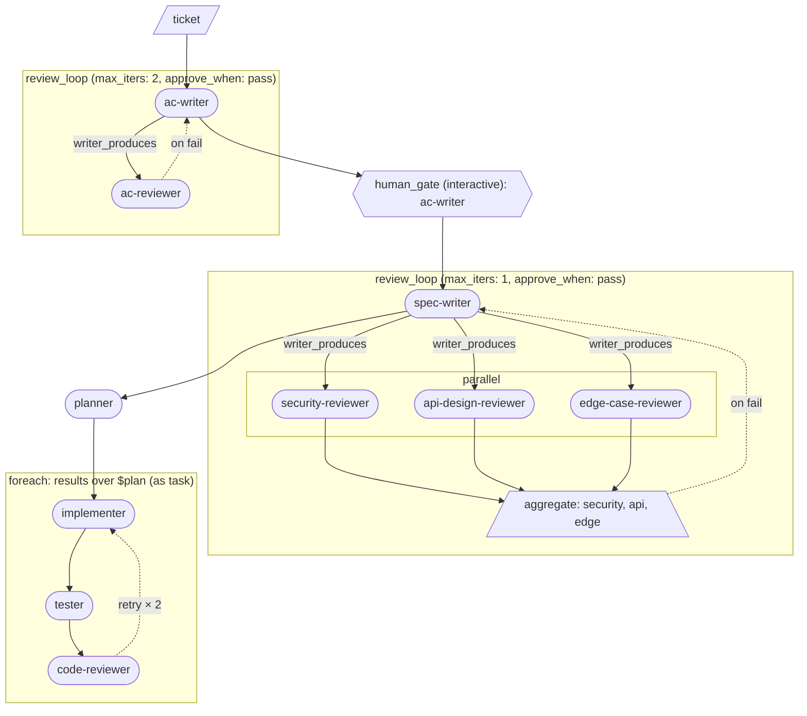

# Getting started with loom

This guide builds a real multi-agent pipeline from scratch, one primitive per chapter. By the end you will have a pipeline that takes a ticket, writes and refines acceptance criteria with a human-in-the-loop checkpoint, produces a technically reviewed spec, and then implements the spec in parallel subtasks — each with its own build-test-review retry loop. The scenario is a concrete engineering ticket: an in-memory rate-limiter middleware. More than wiring agents together, you will be doing **context engineering** — deliberately designing the harness each agent runs inside. Estimated time: ~30 minutes.

---

## Chapter 0 — Before you start

### Prerequisites

- `agenticloom` installed (`npm install -g agenticloom`) and `loom` on your PATH.
- Claude Code CLI installed and authenticated, **or** GitHub Copilot CLI installed and authenticated (see the callout below).

### What an agent persona is

A persona is a Markdown file that tells the CLI agent who it is and what it should do. For Claude Code, personas live in `.claude/agents/<name>.md` in your working directory. A minimal example:

```markdown
---
name: ac-writer
description: Writes acceptance criteria from a ticket
tools: Read, Write
---

You are an acceptance-criteria writer. Read the ticket at the path in
your prompt and write ACS.md containing Given/When/Then scenarios.
```

The frontmatter `name` must match the agent name used in the pipeline. The prompt body is the full system instruction passed to the agent when loom invokes it.

### You're engineering context, not just chaining agents

Keep one idea in mind for the rest of this guide: authoring a loom pipeline is **context engineering**. For each step you decide what the agent sees going in, what it hands off, and how that hand-off reaches the next agent. The pipeline is the deterministic **harness** you build around the agents — and most of its quality comes from the context you route through it, not from the agents themselves.

That is what `produces:` and `$ref` are really for. When one step declares `produces: ACS.md` and a later step takes `input: $acs`, you are choosing the exact context the next agent receives: loom puts that artifact in front of it and leaves everything else out. Small, focused hand-offs — one clear thing per step — are what make the harness work.

It helps to hold two things apart:

- **The real work** happens in your working directory. An agent reads and edits the actual files in the project where you ran `loom`, just as it would in an interactive session.
- **The context hand-off** is the `produces:` artifact. It lands in the run's own folder (`loom/runs/<id>/`), separate from your code, and is what loom carries to the next step — for example the verdict JSON a reviewer emits, or the spec a writer produces.

As you read the chapters, keep asking the context-engineering question: *what does this agent need in front of it, and what should it pass on?*

### Using Copilot CLI instead of Claude Code

Every pipeline in this guide ships with `cli: claude` and a Claude model in `default_extra_args`. To run with Copilot CLI instead, make two changes to any pipeline YAML:

```yaml
cli: copilot                              # was: cli: claude
default_extra_args: ['--model', 'gpt-4.1'] # was: ['--model', 'haiku']
```
Or use this `sed` to make both header changes across all six pipelines at once:

```bash
sed -i.bak \
  -e 's/^cli: claude/cli: copilot/' \
  -e "s/\['--model', 'haiku'\]/['--model', 'gpt-4.1']/" \
  loom/pipelines/*.yaml
```

Persona files for Copilot use a different frontmatter format (lowercase array `tools:` in `.github/agents/` rather than PascalCase comma-separated `tools:` in `.claude/agents/`). The starter pack ships both directories, so both CLIs work out of the box.


### Following along

The `examples/getting-started/` directory is a runnable companion to this guide. Each chapter's pipeline YAML is already there. To run chapter 1 against a ticket:

```bash
cd examples/getting-started
loom run 01-first-step ticket.md --id ch1
```

`loom run` takes the pipeline name and the ticket file as positional arguments. The `--id ch1` names the run's output directory (`loom/runs/ch1/`) — give each chapter its own id, because otherwise loom derives the id from the ticket filename and every chapter would reuse the same directory. Each chapter below opens with its own `loom run` command. Chapters 3 through 6 include a `human_gate` that will pause and hand control to you interactively.

---

## Chapter 1 — Your first pipeline (`step`)

**Run it:**

```bash
loom run 01-first-step ticket.md --id ch1
```

### Why

The simplest thing loom can do is invoke one agent, once, and capture its output. The `step` primitive is that unit. Until you need iteration or parallelism, every flow is just a sequence of steps.

### YAML

```yaml
pipeline: 01-first-step
cli: claude                              # or 'copilot' — see Before you start
default_extra_args: ['--model', 'haiku'] # Copilot: ['--model', 'gpt-4.1']
inputs: [ticket]
flow:
  - step: ac-writer
    input: $ticket
    produces: ACS.md
    bind: acs
```

### Walkthrough

**Header fields**

- `pipeline` — the pipeline's name, also used as its run directory.
- `cli` — which CLI agent runner to use (`claude` or `copilot`). Swap this (and `default_extra_args`) once to run the whole guide under Copilot.
- `default_extra_args` — extra flags appended to every agent invocation. `['--model', 'haiku']` pins a cheap model for tutorial runs; drop the flag or change it for real work.
- `inputs` — the list of named inputs the caller must supply when running the pipeline. Here, `ticket` is the rate-limiter ticket file.

**The `flow` list**

`flow` is an ordered list of primitives. Loom runs them top-to-bottom, threading outputs into subsequent inputs via named bindings.

**`step` fields**

- `step: ac-writer` — the agent persona to invoke. Loom resolves this to `.claude/agents/ac-writer.md` (or `.github/agents/ac-writer.md` for Copilot).
- `input: $ticket` — the `$` prefix dereferences a named binding. `$ticket` resolves to the path of the ticket file you passed on the command line.
- `produces: ACS.md` — the file this agent is expected to write. Loom makes the path available to the agent in its prompt.
- `bind: acs` — after the step completes, bind the path of the produced file to the name `acs`, so later steps can reference it as `$acs`.

### What changed

This is the baseline — a single agent invocation. Subsequent chapters build on top of it.

---

## Chapter 2 — Add a reviewer (`review_loop`)

**Run it:**

```bash
loom run 02-review-loop ticket.md --id ch2
```

### Why

A single agent cannot check its own work reliably. The `review_loop` primitive pairs a writer with a reviewer: the writer produces an artifact, the reviewer emits a structured verdict, and if the verdict is not `pass` the writer revises — up to `max_iters` times. Loom manages the loop; you just name the agents and the verdict contract.

### YAML

```yaml
pipeline: 02-review-loop
cli: claude                              # or 'copilot' — see Before you start
default_extra_args: ['--model', 'haiku'] # Copilot: ['--model', 'gpt-4.1']
inputs: [ticket]
flow:
  - review_loop:
      writer: ac-writer
      reviewer: ac-reviewer
      input: $ticket
      max_iters: 2
      writer_produces: ACS.md
      reviewer_produces: ac-review.json
      verdict_field: status
      approve_when: pass
      bind: ac_final
```

### Walkthrough

**`review_loop` fields (new in this chapter)**

- `writer` / `reviewer` — agent persona names. The writer runs first; the reviewer runs on the writer's output.
- `input` — the initial input passed to the writer on the first iteration. On subsequent iterations, loom automatically appends the reviewer's feedback file to the writer's prompt.
- `max_iters` — the maximum number of writer passes. If the reviewer does not approve within this many iterations, the loop exits with the last artifact.
- `writer_produces` / `reviewer_produces` — the file each side writes. The reviewer's file must be valid JSON.
- `verdict_field` — the JSON key in the reviewer's output that carries the verdict. Here the reviewer writes `{ "status": "pass" | "fail", ... }` and `verdict_field: status` tells loom where to read the decision.
- `approve_when` — the value of `verdict_field` that means "approved". Loom exits the loop early as soon as the reviewer emits this value.
- `bind: ac_final` — binds the path of the final approved artifact, so later steps can reference it as `$ac_final`.

**The reviewer JSON contract — loom provides it**

Notice that `ac-reviewer`'s persona never specifies an output format; it only says *what* to evaluate. That is deliberate: when a `review_loop` names a single reviewer agent — as this one names `ac-reviewer` — loom appends the verdict JSON shape to that reviewer's prompt automatically. The shape it injects is:

```json
{
  "status": "pass" | "fail",
  "findings": [
    {
      "severity": "blocker" | "major" | "nit",
      "summary": "single-line summary",
      "details_md": "full Markdown explanation"
    }
  ]
}
```

loom reads only `verdict_field` (here, `status`) to decide pass/fail; the `findings` are there for the writer to act on when it revises. Because loom owns this contract, every single-agent reviewer emits the same shape without repeating it — the persona stays focused on the evaluation. (A `review_loop` can instead take a *compound* reviewer — several agents plus an `aggregate` — whose agents run as plain steps loom does not inject into; see chapter 4.)

### Diagram


### What changed

Chapter 1's single `step` became a `review_loop` — `ac-writer` and `ac-reviewer` now iterate until the reviewer approves or the iteration cap is reached.

---

## Chapter 3 — Pause for a human (`human_gate`)

**Run it:**

```bash
loom run 03-human-gate ticket.md --id ch3
```

### Why

Automated reviewers can catch structural problems, but some judgment calls need a human. The `human_gate` primitive pauses the pipeline, hands control to a specified agent in interactive mode, and resumes when the human is done. It is the one non-deterministic primitive: loom cannot predict when it exits.

### YAML

```yaml
pipeline: 03-human-gate
cli: claude                              # or 'copilot' — see Before you start
default_extra_args: ['--model', 'haiku'] # Copilot: ['--model', 'gpt-4.1']
inputs: [ticket]
flow:
  - review_loop:
      writer: ac-writer
      reviewer: ac-reviewer
      input: $ticket
      max_iters: 2
      writer_produces: ACS.md
      reviewer_produces: ac-review.json
      verdict_field: status
      approve_when: pass
      bind: ac_final
  - human_gate:
      interactive: true
      agent: ac-writer
      input: $ac_final
      prompt: |
        ACS.md passed automated review. Iterate with the user —
        answer open questions, refine wording, surface gaps.
```

### Walkthrough

**`human_gate` fields (new in this chapter)**

- `interactive: true` — launches the agent in interactive mode (the CLI's interactive flag) so the user can converse with it directly in the terminal.
- `agent` — the persona to invoke at the gate. Using `ac-writer` here means the same agent that produced the ACS is the one refining it interactively.
- `input: $ac_final` — the approved ACS file from the `review_loop`. The agent receives this as context so it can discuss and revise the existing document rather than starting over.
- `prompt` — additional instructions for the agent at this gate. The `|` literal-block scalar preserves line breaks.

**Threading `$ac_final`**

`$ac_final` was bound by the `review_loop` in the previous step. The `human_gate` picks it up by name. This is how loom threads outputs through a pipeline: each primitive declares what it produces (`bind`), and downstream primitives consume it by `$name`.

### What changed

A `human_gate` was added after the `review_loop`. After automated review approves `ACS.md`, the pipeline pauses and you can refine it interactively with `ac-writer` before the pipeline continues.

---

## Chapter 4 — Parallel reviewers (`parallel` + `aggregate`)

**Run it:**

```bash
loom run 04-parallel-review ticket.md --id ch4
```

### Why

Three independent review perspectives — security, API design, and edge cases — do not depend on each other's results. Running them sequentially wastes time. The `parallel` primitive fans them out; `aggregate` collects their verdicts and gates the loop on a combined result. Both primitives are used inside a `review_loop`'s `reviewer:` subflow, not as top-level flow steps.

### YAML

```yaml
pipeline: 04-parallel-review
cli: claude                              # or 'copilot' — see Before you start
default_extra_args: ['--model', 'haiku'] # Copilot: ['--model', 'gpt-4.1']
inputs: [ticket]
flow:
  - review_loop:
      writer: ac-writer
      reviewer: ac-reviewer
      input: $ticket
      max_iters: 2
      writer_produces: ACS.md
      reviewer_produces: ac-review.json
      verdict_field: status
      approve_when: pass
      bind: ac_final
  - human_gate:
      interactive: true
      agent: ac-writer
      input: $ac_final
      prompt: |
        ACS.md passed automated review. Iterate with the user.
  - review_loop:
      writer: spec-writer
      input: $ac_final
      max_iters: 1
      writer_produces: SPEC.md
      approve_when: pass
      bind: spec
      reviewer:
        - parallel:
            - step: security-reviewer
              input: $spec
              produces: security-review.json
              bind: sec
            - step: api-design-reviewer
              input: $spec
              produces: api-review.json
              bind: api
            - step: edge-case-reviewer
              input: $spec
              produces: edge-review.json
              bind: edge
        - aggregate:
            inputs:
              security: $sec
              api: $api
              edge: $edge
            verdict_field: status
            approve_when: pass
            require: all_approved
            bind: spec_verdict
```

### Walkthrough

**The compound `reviewer:` subflow (new in this chapter)**

When `reviewer:` is a list rather than a single agent name, it is a compound subflow. Loom runs it top-to-bottom: here, first the `parallel` fork, then the `aggregate`.

**`parallel` fields**

- `parallel:` — a list of steps to run concurrently. Each entry is a standard `step` (or a nested subflow). All three reviewers receive `$spec` and run at the same time.
- Each step has its own `bind:` (`sec`, `api`, `edge`) so the aggregate can reference their outputs individually.

This spec `review_loop` uses a *compound* reviewer — a subflow of `step`s feeding an `aggregate`, rather than the single reviewer agent chapter 2 used. loom injects the verdict shape only for that single-agent form, so here it injects **nothing**: each reviewer step declares its own output — a JSON object with at least the `status` field the aggregate reads.

**`aggregate` fields**

- `inputs:` — a named map of bindings to aggregate. The keys (`security`, `api`, `edge`) are labels; the values (`$sec`, `$api`, `$edge`) reference the bound reviewer outputs.
- `verdict_field` / `approve_when` — same semantics as in `review_loop`: which JSON key holds the verdict and what value means approved.
- `require: all_approved` — all three reviewers must pass for the aggregate to approve. If any one fails, the aggregate does not approve, and the `review_loop` sends `spec-writer` back to revise `SPEC.md`.
- `bind: spec_verdict` — the aggregate's result is bound for the loop to read. A compound reviewer's terminal `aggregate` must declare `bind:`; loom enforces this at compile time.

**How the loop re-runs on fail**

If the aggregate does not approve, loom invokes `spec-writer` again. The reviewer's findings (the three JSON files) are appended to `spec-writer`'s prompt so it knows what to address.

### Diagram


### What changed

A second `review_loop` was added after the human gate. `spec-writer` produces `SPEC.md` from the approved ACS; three reviewers run in parallel and their verdicts are aggregated before the loop decides whether to loop.

---

## Chapter 5 — Implement with fail-retry (`on_fail`)

**Run it:**

```bash
loom run 05-impl-retry ticket.md --id ch5
```

### Why

Writing an implementation, testing it, and reviewing the result is a tight loop that should self-correct without human input. The `on_fail` field turns the gate step of a sequential zone into a retry trigger: if the reviewer fails, loom replays the zone from a named starting point, feeding the reviewer's findings back to the implementer.

### YAML

```yaml
pipeline: 05-impl-retry
cli: claude                              # or 'copilot' — see Before you start
default_extra_args: ['--model', 'haiku'] # Copilot: ['--model', 'gpt-4.1']
inputs: [ticket]
flow:
  - review_loop:
      writer: ac-writer
      reviewer: ac-reviewer
      input: $ticket
      max_iters: 2
      writer_produces: ACS.md
      reviewer_produces: ac-review.json
      verdict_field: status
      approve_when: pass
      bind: ac_final
  - human_gate:
      interactive: true
      agent: ac-writer
      input: $ac_final
      prompt: |
        ACS.md passed automated review. Iterate with the user.
  - review_loop:
      writer: spec-writer
      input: $ac_final
      max_iters: 1
      writer_produces: SPEC.md
      approve_when: pass
      bind: spec
      reviewer:
        - parallel:
            - step: security-reviewer
              input: $spec
              produces: security-review.json
              bind: sec
            - step: api-design-reviewer
              input: $spec
              produces: api-review.json
              bind: api
            - step: edge-case-reviewer
              input: $spec
              produces: edge-review.json
              bind: edge
        - aggregate:
            inputs:
              security: $sec
              api: $api
              edge: $edge
            verdict_field: status
            approve_when: pass
            require: all_approved
            bind: spec_verdict
  - step: implementer
    input: $spec
    produces: impl-summary.md
    bind: impl
  - step: tester
    input: $impl
    produces: test-summary.md
    bind: tests
  - step: code-reviewer
    inputs:
      impl: $impl
      tests: $tests
    produces: code-review.json
    bind: code_verdict
    on_fail:
      retry_from: impl
      verdict_field: status
      approve_when: pass
      max_retries: 2
      revise_with:
        inputs: [$code_verdict]
```

### Walkthrough

**The implementation zone (new in this chapter)**

Three steps run after the spec is approved: `implementer`, `tester`, and `code-reviewer`. This is where chapter 0's context-engineering distinction gets concrete. The `implementer` writes **real TypeScript into `src/`** in your working directory; its `produces:` file (`impl-summary.md`) is a short **hand-off note** — what it built and where — not the code itself. The `tester` reads that note and the code in `src/`, then writes **real tests into `src/`**, leaving its own note. The `code-reviewer` reads both notes plus the actual `src/` files and emits a verdict.

So the artifacts loom threads between steps (`$impl`, `$tests`) are *context*; the implementation accumulates in `src/`, exactly as it would if you were working in the repo by hand.

**`step` with multiple inputs**

`code-reviewer` uses `inputs:` (plural) — a named map — instead of the single `input:` used in earlier steps. Each key is a label the agent sees, so it can tell the implementation note from the test note.

**`on_fail` fields (new in this chapter)**

- `retry_from: impl` — if the code-reviewer emits a failing verdict, loom replays the zone from the step bound `impl` (the `implementer`). `tester` sits between them, so it re-runs too; the implementer fixes `src/` based on the review.
- `verdict_field` / `approve_when` — same contract as in `review_loop`: the JSON key to read and the value that means approved.
- `max_retries: 2` — how many times the zone may replay before the gate gives up.
- `revise_with.inputs: [$code_verdict]` — on retry, the path of `code-review.json` is added to the implementer's prompt, so it knows what to fix.

Notice there is **no `on_max_exceeded`** here, so it takes its default, `fail`: if the work still hasn't passed after the retries, the zone gives up and the run **halts**. Since `code-reviewer` is the last step, that is the sensible default — better to stop than to finish quietly with code that never passed review. (Chapter 6 overrides this, for a reason that only applies inside `foreach`.)

### What changed

After the spec `review_loop`, three steps now do the build — `implementer` → `tester` → `code-reviewer` — writing real code and tests into `src/`. The `code-reviewer` carries `on_fail`, turning the trio into a self-correcting retry zone that halts if the work never passes.

---

## Chapter 6 — Scale via planner + foreach (`foreach`)

**Run it:**

```bash
loom run 06-foreach ticket.md --id ch6
```

### Why

A real feature decomposes into several modules, and implementing them all in one pass crams everything into a single context. Instead, the `planner` agent reads the spec and emits a JSONL list of ordered tasks; `foreach` runs the same implementation zone once per task. The number of tasks is decided at runtime — you do not hard-code it. Each task implements its module into the **same `src/`**, so the pieces build on one another.

### YAML

```yaml
pipeline: 06-foreach
cli: claude                              # or 'copilot' — see Before you start
default_extra_args: ['--model', 'haiku'] # Copilot: ['--model', 'gpt-4.1']
inputs: [ticket]
flow:
  - review_loop:
      writer: ac-writer
      reviewer: ac-reviewer
      input: $ticket
      max_iters: 2
      writer_produces: ACS.md
      reviewer_produces: ac-review.json
      verdict_field: status
      approve_when: pass
      bind: ac_final
  - human_gate:
      interactive: true
      agent: ac-writer
      input: $ac_final
      prompt: |
        ACS.md passed automated review. Iterate with the user.
  - review_loop:
      writer: spec-writer
      input: $ac_final
      max_iters: 1
      writer_produces: SPEC.md
      approve_when: pass
      bind: spec
      reviewer:
        - parallel:
            - step: security-reviewer
              input: $spec
              produces: security-review.json
              bind: sec
            - step: api-design-reviewer
              input: $spec
              produces: api-review.json
              bind: api
            - step: edge-case-reviewer
              input: $spec
              produces: edge-review.json
              bind: edge
        - aggregate:
            inputs:
              security: $sec
              api: $api
              edge: $edge
            verdict_field: status
            approve_when: pass
            require: all_approved
            bind: spec_verdict
  - step: planner
    input: $spec
    produces: plan.jsonl
    bind: plan
  - foreach:
      over: $plan
      as: task
      body:
        - step: implementer
          input: $task
          produces: impl-summary.md
          bind: impl
        - step: tester
          input: $impl
          produces: test-summary.md
          bind: tests
        - step: code-reviewer
          inputs:
            impl: $impl
            tests: $tests
          produces: code-review.json
          bind: code_verdict
          on_fail:
            retry_from: impl
            verdict_field: status
            approve_when: pass
            max_retries: 2
            on_max_exceeded: continue
            revise_with:
              inputs: [$code_verdict]
      bind: results
      on_iteration_fail: continue
```

### Walkthrough

**`planner` step**

`planner` is a standard `step` that reads `$spec` and writes `plan.jsonl` — one JSON object per line, each an ordered module task:

```jsonl
{"id": "task-1", "title": "Token-bucket core", "details": "Implement a TokenBucket class in src/tokenBucket.ts ..."}
{"id": "task-2", "title": "Express middleware", "details": "Implement rateLimiter(opts) in src/rateLimiter.ts using TokenBucket ..."}
```

The JSONL format is what tells `foreach` how to iterate: each line becomes one iteration, its `task.json` bound to `$task`. Ordering matters — the bucket is implemented before the middleware that imports it.

**`foreach` fields (new in this chapter)**

- `over: $plan` — the JSONL file to iterate. loom reads it line by line; each non-empty line becomes one iteration.
- `as: task` — the per-iteration bind name. Inside the body, `$task` is the path to that line's extracted `task.json`.
- `body:` — the steps to run for each task. Each iteration's binds (`impl`, `tests`, `code_verdict`) are local to that iteration and do not leak out.
- `bind: results` — a list-bound rejoin variable for the whole run; it can't be `$ref`-consumed by a later step.
- `on_iteration_fail: continue` — if an iteration throws an unexpected error (an agent crash, say), loom warns and moves to the next task instead of aborting the whole `foreach`. (Retry-exhaustion is handled by the gate's `on_max_exceeded: continue` above; a deliberate halt still propagates.)

**What's isolated, and what isn't**

`foreach` isolates each iteration's *context*, not its code. Every agent — including those in a `foreach` body — runs in your working directory, so all the iterations write into the **same `src/`** and their modules compose. What lands in the per-iteration folder (`loom/runs/<id>/results/iter-N/`) is only the `produces:` hand-off notes for that task. This is chapter 0's distinction in action: code is shared and accumulates; context is curated per step.

**`on_fail` inside `foreach`**

The `on_fail` on `code-reviewer` works like chapter 5's — `retry_from: impl` replays only the current iteration's zone, not any other iteration's work. One difference: here it sets `on_max_exceeded: continue`, where chapter 5 used the default (`fail`). Inside a batch you usually don't want one stuck task to halt all the rest, so on exhaustion the iteration keeps its last attempt and `foreach` moves on.

### Diagram



### What changed

Chapter 5's single-shot zone became a `planner` step plus a `foreach` that runs the same `implementer` → `tester` → `code-reviewer` zone once per planned task — each writing into the shared `src/`. The gate now sets `on_max_exceeded: continue`, so one unfixable task doesn't abort the batch.

---

## Chapter 7 — Where to go next

**Full field reference — `PRIMITIVES.md`**

Every field for every primitive is documented in [`PRIMITIVES.md`](PRIMITIVES.md) at the repo root. When you need exact semantics, required vs. optional fields, or type constraints, that is the definitive reference.

**AI-assisted pipeline authoring — the `loom-author` skill**

If you use Claude Code, the `loom-author` skill is available in this repo. It knows loom's YAML schema and can draft or modify pipeline YAMLs from a description. Invoke it with `/loom-author` followed by what you want to build.

**Battle-tested pipelines — `smoke_test/`**

The [`smoke_test/`](smoke_test/) directory contains integration-test pipelines that run against real tickets on every CI pass. They are more complete and more carefully tuned than the tutorial stubs. Reading them is a good way to see how production-quality personas and pipelines differ from the minimal examples in this guide.

**The next primitive — `branch`**

`branch` lets you route flow conditionally based on the contents of a bound artifact. It is not covered in this guide (out of scope by design), but it is documented in `PRIMITIVES.md` and is the natural next primitive to explore once you are comfortable with the six covered here.
