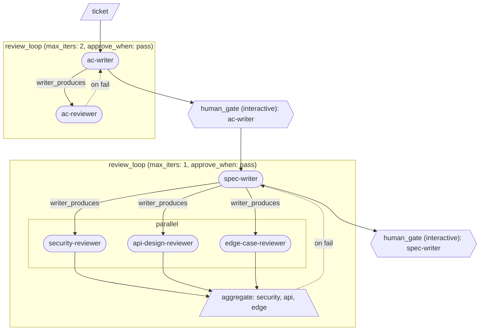

# Loom

[](https://www.npmjs.com/package/agenticloom)
[](https://github.com/gwaihir4031/agenticloom/blob/main/LICENSE)
[](https://www.npmjs.com/package/agenticloom)

> _Weave your agents into pipelines._

A meta-harness compiler that turns YAML pipelines into TypeScript scripts
you can read, run, and version. Composes Claude Code and Copilot CLI
invocations into reproducible multi-step workflows with **verification,
recovery, and human-in-the-loop as first-class primitives.**

For engineers who want multi-step AI workflows to run identically every
time — no LLM supervisor, no token tax for plumbing.

> **New to loom?** Read the [getting-started guide](GETTING_STARTED.md) —
> a ~30-minute walkthrough that builds up a real multi-agent pipeline
> one primitive at a time. Want to run as you read? Use the
> [starter pack](examples/getting-started/).

## Why this exists

- **You own the orchestration logic.** It's a deterministic script,
  not an LLM making routing decisions.
- **CLI-flexible.** Each pipeline's YAML header declares which CLI runs
  it. Different pipelines can target different CLIs; multi-CLI mixing
  within one pipeline isn't supported today (no concrete use case
  surfaced — easy to add back additively if one does).
- **Uses your subscription.** No API keys needed — `claude -p` and
  `copilot -p` use whatever auth you already have.
- **Harness-engineering primitives baked into the DSL.** `review_loop`
  (writer ↔ reviewer convergence), `aggregate` (multi-reviewer with
  retry gates), `foreach` (iterate per-item over a runtime-produced
  list), `human_gate` (sit a human between automated steps), `on_fail`
  / `retry_from` / `--resume-from` (recovery without a full manual
  rerun) — structures harness engineers usually hand-roll.
- **Production guardrails.** `max_iters` (bounded convergence for review
  loops), `on_max_exceeded` (fallback when aggregate hits the cap),
  `on_iteration_fail` (per-iteration failure handling for foreach) —
  so production harnesses don't loop forever or silently swallow
  failures.

## Install

Prerequisites:

- **Node.js 20+**
- **`claude` (Claude Code) and/or `copilot` (GitHub Copilot CLI) on
  your PATH, authenticated.** Loom shells out to whichever CLI your
  pipeline declares; it doesn't make API calls itself.

Install in a project:

```bash
npm install -D agenticloom
# then: npx loom run <pipeline-name> ...
```

Or globally:

```bash
npm install -g agenticloom
# then: loom run <pipeline-name> ...
```

The CLI is available as either `loom` or `agenticloom` — they're
aliases. Most examples in this README use `loom run ...`.

## DSL

Seven primitives cover ~95% of pipelines:

| Primitive     | What it does                                                                      |
| ------------- | --------------------------------------------------------------------------------- |
| `step`        | Run one agent                                                                     |
| `review_loop` | writer ↔ reviewer cycle with `max_iters` + JSON verdict                           |
| `human_gate`  | Plain y/N prompt, or spawn an interactive agent REPL                              |
| `parallel`    | Fan out via `Promise.all`                                                         |
| `branch`      | If/else on any JS expression                                                      |
| `aggregate`   | Deterministically combine labeled inputs into one verdict                         |
| `foreach`     | Iterate a runtime-produced JSONL list; per-iteration body in a sealed scratch dir |

Each primitive optionally takes a **`bind: <name>`** field (not a primitive
itself — a field on most primitives) that saves the output for later steps.
Reference a bound variable with `$name` in `input:` fields, or as values in
the labeled `inputs:` map.

**Agents communicate via files, never via stdout-piped-into-prompts.**
`produces:` (and `writer_produces:` / `reviewer_produces:` on
`review_loop`) names a workspace-relative path the agent must write.
Downstream consumers receive that path as their input and read the file
with their own Read tool. A `$name` reference resolves to the producer's
path.

`review_loop` writes a JSON verdict file (`reviewer_produces:`) with
shape `{status, findings: [{severity, summary, details_md}]}`; loom
extracts `verdict_field` (typically `status`) and approves when it
equals `approve_when:` (default `pass`). On fail, the writer is
re-invoked with a revise prompt that points at both the previous
draft's path and the reviewer's verdict file; the writer reads both
and addresses blocker/major findings. `aggregate` uses the same JSON
contract across labeled inputs and returns the overall verdict as an
in-memory string (no derived consolidated document — downstream
consumers read the per-input files directly).

**Loose-pattern retry gates.** Both `step` (via `on_fail:`) and
`aggregate` (via top-level `retry_from:` / `max_retries:` /
`on_max_exceeded:` / `revise_with:` fields) can act as a retry gate
that re-runs an upstream zone. `revise_with:` is required when
`retry_from:` is set — it tells loom what feedback to surface to the
retry target on revise. Two shapes:

- `inputs: [$ref, ...]` — loom auto-builds a revise prompt naming the
  target's prior draft path plus each referenced file (each `$ref`
  must be a file-bound bind). Use this for the canonical "reviewers
  wrote feedback files, surface them to the writer" shape.
- `prompt: <string>` — loom uses your prompt verbatim with no
  auto-scaffolding. Use when you want exact control over the revise
  message.
- Both — your prompt is the leading message; loom appends the
  feedback-file list after it.

The loose pattern (`step` writer + `parallel` reviewers + `aggregate`
gate with `retry_from`) is a complete substitute for compound
`review_loop`, with the bonus that per-reviewer binds are naturally
accessible to downstream steps (parallel children hoist).

## Authoring with the `loom-author` skill

The repo ships a skill at `skills/loom-author/SKILL.md` that knows the
YAML grammar, primitive shapes, and common patterns. Same file works
for both supported CLIs. Two ways to use it:

- **As a Claude Code or Copilot CLI skill** — copy the skill directory
  from your agenticloom install to the CLI's skills directory. The
  skill must live at `<skills-dir>/loom-author/SKILL.md` for the CLI
  to discover it:

  ```bash
  # Pick the destination for your CLI (change once, applies below)
  SKILLS_DIR=~/.claude/skills    # or ~/.copilot/skills for Copilot CLI
  mkdir -p "$SKILLS_DIR"

  # Globally-installed agenticloom (npm install -g agenticloom):
  cp -r "$(npm root -g)/agenticloom/skills/loom-author" "$SKILLS_DIR/"

  # Project-local agenticloom (npm install -D agenticloom):
  cp -r ./node_modules/agenticloom/skills/loom-author "$SKILLS_DIR/"
  ```

  Once installed, your CLI will invoke the skill automatically on
  requests like "write me a loom pipeline that…" or "add a reviewer to
  my pipeline".

- **As a reference** — open the file directly. It's a compact
  field-level cheat sheet plus seven pattern recipes (single-reviewer
  convergence, multi-reviewer with retry, foreach, fork-rejoin
  branch, etc.) — enough to bootstrap a new pipeline in one read.

For the canonical field-by-field schema (every primitive, every
cross-field rule, every error model), see `PRIMITIVES.md` — bundled
with the package at `$(npm root -g)/agenticloom/PRIMITIVES.md` for
global installs, or `./node_modules/agenticloom/PRIMITIVES.md` for
project-local installs.

## Why "Loom"?

A loom is the device that turns separate threads into woven fabric.
The metaphor maps onto this tool almost line-for-line:

- **The warp = your agents.** Warp threads run lengthwise on the loom,
  held under tension. That's your `.claude/agents/<name>.md` personas —
  defined once on disk, referenced by pipelines that point at them. The
  pipeline header tells loom which CLI and which directory to find them
  in. (A future workspace-level config can declare cross-pipeline
  defaults; today each pipeline declares its own.)

- **The weft = your pipeline.** The thread that crosses through the
  warp, over and under, defining the pattern. Each YAML pipeline is a
  weft passing through your agents in a specific order. **Same warp,
  different weft = different fabric.**

- **The shed = the review loop.** When weavers raise some warp threads
  and lower others to let the weft pass through, that gap is called the
  shed. `review_loop` opens a shed between writer and reviewer, passes
  work back and forth through it until the pattern is right (or
  `max_iters` hits), then closes.

- **The shuttle = the runtime.** The shuttle physically carries the
  weft thread across the loom. That's `src/runtime/` — `runAgent`
  (`agent.ts`), `reviewLoop` (`review-loop.ts`), `humanGate`
  (`human-gate.ts`). What actually moves work between agents.

- **The pattern card = the compiled TypeScript.** Old Jacquard looms
  read punched cards encoding which warp threads to raise for each
  pass. The compiler emits that card — readable TypeScript you can
  debug, version, or hand-edit if the YAML can't express something.

- **The finished cloth = the Mermaid view.** When you step back from
  a loom, you see the pattern as a whole. The Mermaid diagram emitted
  alongside the compiled `.ts` is that view: same source, just looked
  at from above.

The metaphor pays off in a few concrete ways:

- It resists scope creep. "Does this feature belong on the loom?"
  is a real test. If the answer is "no, it's an opinion the supervisor
  agent would hold" — it doesn't belong. A loom follows the pattern
  card; it doesn't decide.
- It gives natural names for future concepts. Reusable pipelines are
  patterns. A library of pipelines is a tapestry. A primitive type
  is a weave structure.

## Example: AC → spec → multi-reviewer pipeline

A pipeline you might author at `<your-repo>/loom/pipelines/multi-review.yaml`:

```yaml
pipeline: multi-review
cli: claude
default_extra_args: ['--model', 'sonnet']
inputs: [ticket]

flow:
  # Stage 1: Acceptance criteria — single-reviewer review_loop.
  - review_loop:
      writer: ac-writer
      reviewer: ac-reviewer
      input: $ticket
      max_iters: 2
      writer_produces: ACS.md
      reviewer_produces: ac-review.json
      verdict_field: status
      approve_when: pass
      bind: ac_final

  - human_gate:
      interactive: true
      agent: ac-writer
      input: $ac_final
      prompt: |
        ACS.md has passed automated review. Iterate with the user
        — answer open questions, refine wording.

  # Stage 2: Technical spec — compound review_loop. The reviewer
  # subflow runs three reviewers in parallel and aggregates their
  # verdicts. On fail, spec-writer is re-invoked with all three
  # reviewer paths in its revise prompt.
  - review_loop:
      writer: spec-writer
      input: $ac_final
      max_iters: 1
      writer_produces: SPEC.md
      approve_when: pass
      bind: spec
      reviewer:
        - parallel:
            - step: security-reviewer
              input: $spec
              produces: security-review.json
              bind: sec
            - step: api-design-reviewer
              input: $spec
              produces: api-review.json
              bind: api
            - step: edge-case-reviewer
              input: $spec
              produces: edge-review.json
              bind: edge
        - aggregate:
            inputs:
              security: $sec
              api: $api
              edge: $edge
            verdict_field: status
            approve_when: pass
            require: all_approved
            bind: spec_verdict

  - human_gate:
      interactive: true
      agent: spec-writer
      input: $spec
      prompt: |
        SPEC.md has passed multi-reviewer review. Iterate with the
        user on it before implementation.
```

## Pipeline configuration + agent discovery

The pipeline YAML header declares the cli + optional default CLI flags.
Persona files (e.g. `.claude/agents/<name>.md`) hold the agent's system
prompt + frontmatter:

```yaml
pipeline: multi-review
cli: claude # required: 'claude' or 'copilot'
default_extra_args: ['--model', 'sonnet'] # optional; applied to every agent
inputs: [ticket]
flow:
  - step: ac-writer # resolves to .claude/agents/ac-writer.md
    extra_args: ['--model', 'haiku'] # optional; replaces default for this step
    input: $ticket
    produces: ACS.md
```

**Agent references: persona name or inline agent.** Anywhere an agent is
named — `step:`, `review_loop.writer`, `review_loop.reviewer` — the value
is either a persona name or an inline agent:

- **A persona name** (string) — loom delegates to the CLI's native
  `--agent <name>`, so the CLI loads the agent file and **enforces its
  `tools:`**; loom no longer inlines the persona body. The persona file
  must be discoverable via the layered lookup below — missing files are
  caught at compile time (a bare-cli agent with no body still works as a
  frontmatter-only file). On claude the persona's `tools:` bind even under
  `--dangerously-skip-permissions` (real least privilege). On copilot the
  same `--agent` delegation applies, though copilot's CLI-side enforcement
  of agent `tools:` is version-sensitive and not yet in effect in current
  releases — loom delegates and adds no workaround. The agent-file leaf is
  cli-aware: `.claude/agents/<name>.md` for claude,
  `.github/agents/<name>.agent.md` for copilot.
- **An inline agent** (`{ prompt, name }`) — a one-off general agent with
  no persona file, spawned with **all tools**. `prompt:` is the task
  (required; static text — no `$ref` interpolation, so per-invocation data
  flows via `input:` / `inputs:` as before). `name` is required — the
  agent's identity in logs, window titles, error messages, and mermaid
  nodes.

A general `human_gate` agent is expressed by **omitting `agent:`** on an
interactive gate — the gate's already-required `prompt:` is the task, run
with all tools. See `PRIMITIVES.md` for the full agent-reference grammar.

**Layered agent discovery.** The agent's persona directory is driven by
the pipeline's `cli:` field. For each agent name, loom probes the
project layer first, then the user-global layer; project wins on
collision:

| Pipeline `cli:` | Project layer                          | Global layer                        |
| --------------- | -------------------------------------- | ----------------------------------- |
| `claude`        | `<cwd>/.claude/agents/<name>.md`       | `~/.claude/agents/<name>.md`        |
| `copilot`       | `<cwd>/.github/agents/<name>.agent.md` | `~/.copilot/agents/<name>.agent.md` |

Pipelines are discovered the same way regardless of `cli:`:
`loom run <name>` looks in `<cwd>/loom/pipelines/<name>.yaml` first,
then `~/.loom/pipelines/<name>.yaml`.

## Run

Reference pipelines by **name** — loom resolves `<name>` to
`loom/pipelines/<name>.yaml` in the current directory:

```bash
# Compile to a JS module you can read/edit/version
loom compile multi-review run.mjs

# Or compile + run in one step
loom run multi-review "JIRA-1234: Add 2FA"
```

For a stable, predictable workspace location, pass `--id`:

```bash
loom run multi-review ./tickets/RATE-1.md --id RATE-1
# → loom/runs/RATE-1/
```

When no `--id` is given, loom infers one from the first existing-file
argument or falls back to `<pipeline>-<timestamp>`. See "Workspace +
outputs" for the resolution rules.

Pass a path (anything ending in `.yaml`/`.yml` or containing `/`) to
bypass name resolution — useful when your pipelines live somewhere
other than `loom/pipelines/`:

```bash
loom run ./workflows/ship.yaml "JIRA-1234"
```

The emitted module imports from the `agenticloom/runtime` package, so it's
portable — version it, hand-edit it, or run it on another machine
that has agenticloom installed.

## Mermaid diagram

Every `loom compile` writes two files side-by-side: the TypeScript
script and a `<output>.mermaid` diagram of the pipeline shape.
Containers (`review_loop`, `parallel`, `branch`, `foreach`) render as
labeled subgraphs; `bind:` names appear as edge labels.

Here's the diagram `loom compile` emits for the multi-reviewer example
pipeline above:



GitHub renders Mermaid inline in markdown files and pull requests, so
committing the `.mermaid` next to the `.ts` gives PR reviewers a
visual of the pipeline they don't have to read TypeScript to follow.
It's the "finished cloth" view of the loom metaphor — same source,
seen from above.

## Workspace + outputs

`loom run` creates a workspace directory at `loom/runs/<id>/` under
your current directory and runs the compiled pipeline from there.
Agent-produced files (`produces:` paths, `--save-logs` output at
`logs/<agent>.log`) land in the workspace; your invocation cwd stays
clean. Pipelines themselves live alongside their outputs under the
same `loom/` parent (`loom/pipelines/` for sources, `loom/runs/` for
runs).

Pass `--save-logs` to capture each agent's full stdio under
`loom/runs/<id>/logs/<agent>.log` — useful for debugging when an
agent's output isn't what you expected.

The workspace `<id>` is resolved in this order (first match wins):

1. **`--id <name>`** — explicit flag, always wins.
   `loom run multi-review ./smoke_test/ticket-bug.md --id RATE-1`
   → `loom/runs/RATE-1/`

2. **Filename basename of the first existing-file arg.**
   `loom run multi-review ./tickets/RATE-1.md`
   → `loom/runs/RATE-1/` (no flag needed when the ticket file is
   named after the ticket ID)

3. **`<pipeline>-<timestamp>` fallback.** Safety net so loom never
   silently writes into your project root.
   `loom run multi-review some-literal-string`
   → `loom/runs/multi-review-1700000000000/`

The compiled pipeline's temp `.mjs` lives in `os.tmpdir()/loom-*/`
(not your project root) and is removed on exit. A best-effort
startup sweep removes orphan `loom-*` temp dirs older than 24h —
mainly a Windows safety net; macOS and Linux periodic cleaners
handle this anyway.

Rerunning against the same `<id>` reuses the existing workspace
directory; agents overwrite prior outputs. Rename the dir
(`mv loom/runs/RATE-1 loom/runs/RATE-1.attempt-1`) to stash a
prior run.

**Resume from a named bind** with `--resume-from <bind>` (requires
`--id <name>` and an existing workspace). Items before the cursor
are skipped — their bind values become path string literals to the
prior run's `produces:` files. Items from the cursor onward run
normally. The cursor must name a top-level bind; nested binds
(inside `parallel`, `branch`, or `review_loop` subflows) are
rejected at the CLI. Missing input files fail loud at the first
consumer (no upfront validation walk).

```bash
loom run multi-review ./tickets/RATE-1.md --id RATE-1 --resume-from spec
# pre-cursor binds (e.g. $ac_final) resolve to existing files;
# the `spec` step and everything after run normally.
```

## Project layout

```
your-project/
├── loom/
│   ├── pipelines/      # YAML pipeline definitions
│   │   └── my-pipeline.yaml
│   └── runs/           # gitignored — workspace dirs created by `loom run`
└── .claude/agents/     # project-layer persona files; per-cli convention
    └── writer.md       # see "Pipeline configuration + agent discovery" above
```

## What a compiled pipeline looks like

The compiler emits readable TS — full output is longer, this shows the structural shape:

```typescript
// AUTO-GENERATED from loom/pipelines/multi-review.yaml
import { runAgent, reviewLoop, humanGate, parallel, aggregate } from 'agenticloom/runtime';

// Pipeline-header config baked in as module-level constants and threaded
// through every runtime call.
const CLI = 'claude';
const AGENT_DIRS = ['.claude/agents/', '~/.claude/agents/'];
const DEFAULT_EXTRA_ARGS = ['--model', 'sonnet'];

async function main(ticket) {
  const ac_final = await reviewLoop({
    kind: 'single',
    cli: CLI,
    agentDirs: AGENT_DIRS,
    defaultExtraArgs: DEFAULT_EXTRA_ARGS,
    writer: 'ac-writer',
    reviewer: 'ac-reviewer',
    input: ticket,
    maxIters: 2,
    writerProduces: 'ACS.md',
    reviewerProduces: 'ac-review.json',
    verdictField: 'status',
    approveWhen: 'pass',
  });
  await humanGate({
    interactive: true,
    agent: 'ac-writer',
    cli: CLI,
    agentDirs: AGENT_DIRS,
    extraArgs: DEFAULT_EXTRA_ARGS,
    input: ac_final,
    prompt: 'ACS.md has passed automated review. Iterate with the user...',
  });
  const spec = await reviewLoop({
    kind: 'compound',
    cli: CLI,
    agentDirs: AGENT_DIRS,
    defaultExtraArgs: DEFAULT_EXTRA_ARGS,
    writer: 'spec-writer',
    reviewerSubflow: async (spec) => {
      // reviewerSubflow: parallel reviewers + aggregate (see PRIMITIVES.md for the compound review_loop shape)
    },
    input: ac_final,
    maxIters: 1,
    writerProduces: 'SPEC.md',
    approveWhen: 'pass',
  });
  // ... interactive spec gate follows the same humanGate shape as above
}
```
